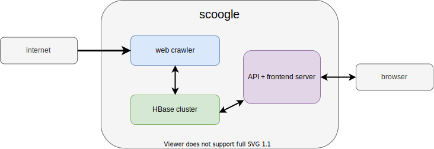
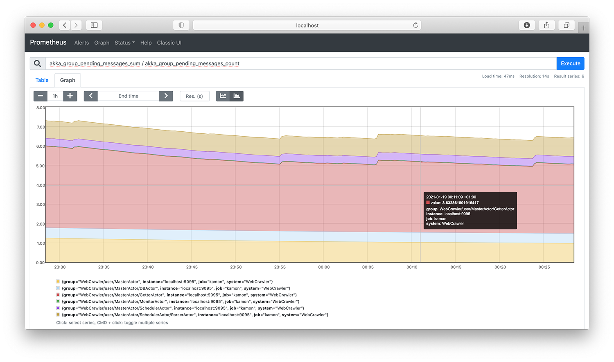

# Scoogle

Scoogle is a Search Engine written in Scala and using Akka Actors. Its components are a web crawler, a HBase data store,
a server serving a backend API and a frontend written in React. The HBase master, ZooKeeper and servers need to be
started first, either locally or remotely, either on the local filesystem or on HDFS. The address and port number of the
ZooKeeper Quorum server are given to the Scoogle web crawler and server.


## Web Crawler based on *Akka Actors*

### Architecture



### Seed

The web crawler takes as input the seed in the shape of one or more XML files. Find below an example of such a file. The
different fields designate the following:

- `link` The link to a source. This can be a file on the local filesystem or a http(s) website. The web crawler will
  take all the links as a seed.
- `depth` The depth up to which each source will be crawled.

```xml

<sources>
    <source>
        <link>https://www.wikipedia.com</link>
        <depth>3</depth>
    </source>
    <source>
        <link>file:///path/to/file.html</link>
        <depth>1</depth>
    </source>
</sources>
```

### Terminating

Ideally the program should be terminated with a `SIGTERM` signal rather than `SIGINT`, `SIGABRT` or `SIGKILL` so that
the HBase connection can close gracefully and flush buffered data.

### Monitoring

The web crawler exposes [Kamon](https://kamon.io) metrics in a [Prometheus](https://prometheus.io) format on a scraping
endpoint on ` http://localhost:9095`. A Prometheus server can be started in order to view the various Akka metrics.



### Benchmark

The web crawler is able to crawl and store approximately 35 pages per second on a `e2-standard-4` GCE instance (4 vCPUs,
16 GB memory).

### Running

After running `mvn clean package`, run `java -jar ./target/web-crawler.jar [options] [source ...]`

The options are

- `--zooKeeperAddress` The address of the ZooKeeper Quorum server. Defaults to `localhost`.
- `--zooKeeperPort` The port of the ZooKeeper Quorum server. Defaults to `2181`.
- `--maxConcurrentSockets` The maximum number of sockets that the program will open simultaneously. Defaults to 30.
  Sometimes if this number is too large, the requests will time out.
- `-h, --help` Show help message.

followed by a list of source xml files in the format described above.

## Server based on *Akka HTTP*

### Keyword highlighting

The server will try to find the webpages that maximize the number of searchbar keywords occurring in it. The keywords
are reduced to their stem form. For example, `eating` or `eaten` will be mapped to the stem `eat`. After that, the
keywords are mapped to a possible synonym. For example `magenta` is mapped to `red`. This was achieved using
the [Apache Lucene](https://lucene.apache.org/core/) core library. All the keywords typed into the searchbar must occur
at least once in the webpage for it to appear in the result list.

A special feature of the searchbar is to surround keywords with quotes (e.g. `"apple"`). Both quoted and unquoted
keywords must appear at least once in the webpage, but only quoted keywords will be highlighted in the result list. If
there are no quoted keywords, all the unquoted keywords are highlighted.

### Speed

The server is extremely fast in retrieving the list of webpages from a query (usually displays the results in less than
a second). The HBase database maintains an inverted index table indexing keywords to the webpage they occur in. This
table is indexed on the keywords, rendering a keyword lookup extremely fast. The latest query is always cached which
means that upon clicking on the pagination buttons, the query does not need to be processed again, and the webpages do
not need to be fetched again from the database.

### Running

An *Akka HTTP* server runs and serves the following routes:

- `/` The frontend consisting of the static files inside the */build* folder
- `/api` Given a `query` HTTP parameter representing a list of space-separated keywords and a `pageNumber` parameter,
  this route will respond with a list of at most ten links that match against those keywords for the given `pageNumber`.

#

After running `mvn clean package`, run `java -jar ./target/server.jar [options]`

The options are

- `--serverInterface` The interface on which the server listens. Defaults to `localhost`.
- `--serverPort` The port number on which the server listens. Defaults to `8080`.
- `--zooKeeperAddress` The address of the ZooKeeper Quorum server. Defaults to `localhost`.
- `--zooKeeperPort` The port of the ZooKeeper Quorum server. Defaults to `2181`.
- `-h, --help` Show help message.

## Frontend written in *React*

Inside the *frontend* directory, run `npm start` in order to serve the frontend in developer mode. Run `npm run build`
to build the production files. When the build has completed, the static files will be located inside the *target*
directory of the maven project and will be served by the `Server` class.

The frontend consists of a home page with a searchbar. Upon hitting a *Search* button, the frontend displays a list of
websites matching the keywords put in the searchbar. The pagination groups the links by 10.

